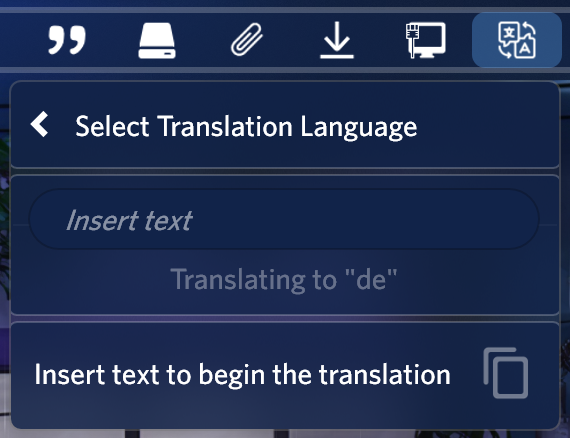

<link rel="stylesheet" href="https://cdnjs.cloudflare.com/ajax/libs/font-awesome/4.7.0/css/font-awesome.min.css">

<h1 align="center">
   
  
   
  Translator - Bunz
   
</h1>

<h4 align="center">Translate using the Google Translator API.</h4>

  
  
  
  

  <a href="#key-features">Key Features</a> •
  <a href="#how-to-use">How To Use</a> •
  <a href="#download">Download</a> •
  <a href="#license">License</a>

## Key Features

I have readjusted the <a href="https://www.deviantart.com/eclectic-tech/art/Illustro-Quotes-Patch-1-1-2015-11-11-564733769">Illustro Quotes</a> skin by <a href="https://www.deviantart.com/eclectic-tech">Eclectic-Tech</a> to fit in the app and in the <a href="https://www.deviantart.com/cariboudjan/art/droptop-four-762812007">Droptop Four</a> style, and in future updates I'm going to increse the features that this app offers.

## How to use

Select the language you want to translate from in the settings (default is automatic) and the language you want to translate to.

Then start typing in the text box, hit *Enter* the translation will appear in the box below. If you click on the translation, the text will be added to your clipboard.

## Download

Download from [releases](https://github.com/66Bunz/DroptopFour-Translator/releases) or from the [website](https://droptopfour.com/community-apps?id=24)

## License

<a href="https://www.gnu.org/licenses/gpl-3.0.html">GNU General Public License v3.0</a> 
Feel free to modify or redistribute these Rainmeter skins as much as you want. Just:
- Link back to me somehow
- Use ths same license
